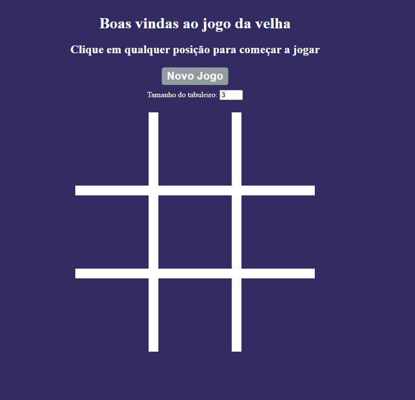

# Jogo da Velha (Tic-Tac-Toe) - JavaScript Orientado a Objetos



Este é um projeto simples de Jogo da Velha (Tic-Tac-Toe) desenvolvido em JavaScript utilizando o paradigma de orientação a objetos. O objetivo é proporcionar uma experiência interativa no navegador, permitindo que dois jogadores disputem partidas de forma dinâmica.

## Funcionalidades
- Interface intuitiva e responsiva
- Dois jogadores (X e O)
- Detecção automática de vitória ou empate
- Reinício rápido da partida
- Código organizado com classes e métodos

## Estrutura do Projeto
```
estilo.css      # Estilos do jogo
index.html      # Página principal do jogo
script.js       # Lógica do jogo (orientação a objetos)
REAME.md        # Este arquivo de documentação
```

## Como Executar
1. Clone ou baixe este repositório.
2. Abra o arquivo `index.html` em seu navegador preferido.
3. Jogue normalmente clicando nas casas do tabuleiro.

## Sobre a Implementação
A lógica do jogo foi implementada utilizando classes JavaScript para garantir organização e reutilização de código. Os principais conceitos de orientação a objetos aplicados incluem:
- **Encapsulamento:** Separação da lógica do jogo em classes e métodos.
- **Responsabilidade única:** Cada classe/método tem uma função bem definida.
- **Facilidade de manutenção:** O código é modular e fácil de entender.

## Exemplo de Classe (resumo)
```js
class JogoDaVelha {
  constructor() { /* ... */ }
  iniciarJogo() { /* ... */ }
  fazerJogada(posicao) { /* ... */ }
  verificarVencedor() { /* ... */ }
  reiniciar() { /* ... */ }
}
```

## Autor
- Projeto desenvolvido para fins de estudo e prática de JavaScript, ministrado pela professora Letícia Garcez no curso de Fundamentos da Formação Dev da Cod3r.

---
Sinta-se à vontade para contribuir ou sugerir melhorias!
